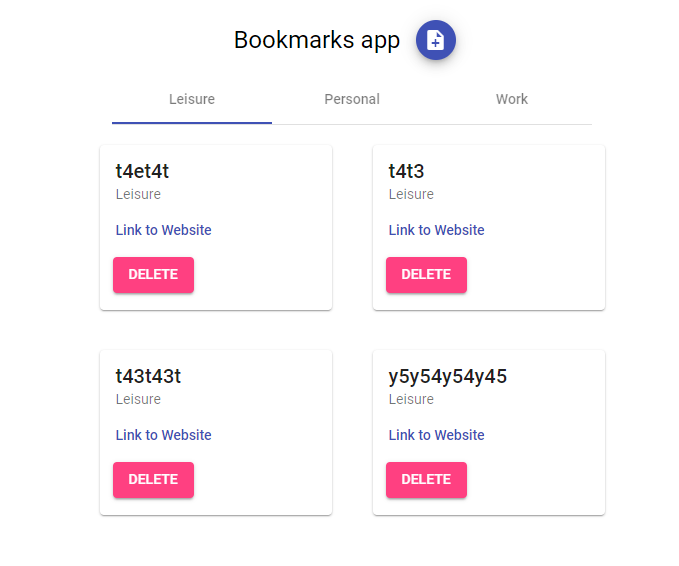
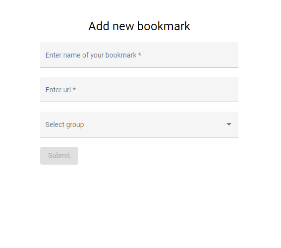

# Bookmark

Bookmark is an app for creating personalized bookmarks.

## Development server

Run `ng serve` for a dev server. Navigate to `http://localhost:4200/`. The app will automatically reload if you change any of the source files.

```bash
ng serve
```

## Build

Run `ng build` to build the project. The build artifacts will be stored in the `dist/` directory.

```bash
ng build
```

# Home page



# Add new bookmark page

